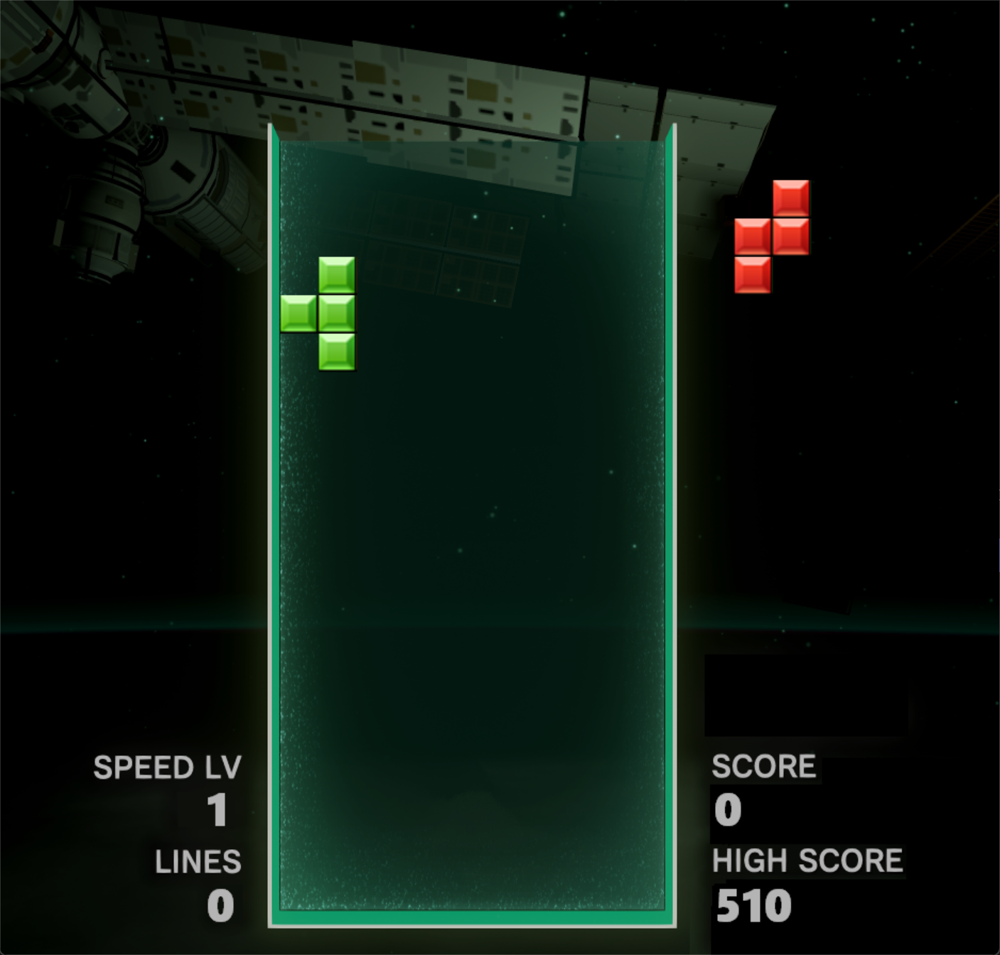

# Tetris俄罗斯方块游戏



经典俄罗斯方块游戏的C++实现，基于EasyX图形库开发，支持高分记录、音效系统和动态难度调整。

## 🎮 功能特性

- ​**​经典玩法​**​：还原NES版俄罗斯方块核心机制
- ​**​视听体验​**​：支持背景音乐和音效系统
- ​**​难度系统​**​：5个递增难度等级（速度提升）
- ​**​高分记录​**​：本地保存历史最高分
- ​**​响应控制​**​：支持键盘方向键快速操作
- ​**​作弊模式​**​：开发者调试功能（按`I`键切换方块）

## 🛠️ 技术栈

- C++11 标准
- EasyX 图形库（Windows平台）
- Makefile 构建系统
- WinMM 音效支持

## 📥 快速开始

### 从源代码构建

​**​系统要求​**​：
- Windows 10/11
- MinGW-w64 (g++ 8.1+)
- [EasyX 2022](https://easyx.cn)

​**​构建步骤​**​：
```bash
# 克隆仓库
git clone https://github.com/AbyssFerry/cpp-tetris.git
cd Tetris

# 安装依赖（项目自带无需安装）
# 1. 从EasyX官网下载安装包
# 2. 将 include/easyx.h 和 lib/libeasyx.a 放入项目对应目录

# 编译项目
make all

# 运行游戏
./game.exe
```

### 使用预编译版本

1. 前往 [Releases 页面](https://github.com/AbyssFerry/Tetris/releases) 下载最新版
2. 解压后直接运行 `game.exe`
3. 确保 `res` 文件夹与可执行文件同级

> ​**​注意​**​：部分杀毒软件可能误报，请添加白名单

## 🕹️ 操作指南

| 按键       | 功能                |
|------------|--------------------|
| ← →        | 左右移动方块        |
| ↑          | 旋转方块            |
| ↓          | 加速下落            |
| 空格       | 暂停/恢复游戏       |
| ESC        | 退出游戏            |

## 📁 项目结构

```bash
cpp-tetris/
├── res/            # 资源文件（图片/音效）
├── Tetris/         # 源代码
│   ├── Block.*     # 方块逻辑
│   ├── Tetris.*    # 游戏引擎
│   └── main.cpp    # 入口文件
├── Makefile        # 构建配置
└── recorder.txt    # 高分记录
```

## 👥 贡献者

- ​**​AbyssFerry​**​ - 项目发起者 & 核心开发者  
  [](https://github.com/AbyssFerry)
- **学习视频** - 基础框架和图片资源  
  [](https://www.bilibili.com/video/BV1ia411K7AE/?share_source=copy_web&vd_source=dafdbe9349f351eda94a4049eec75e25)
